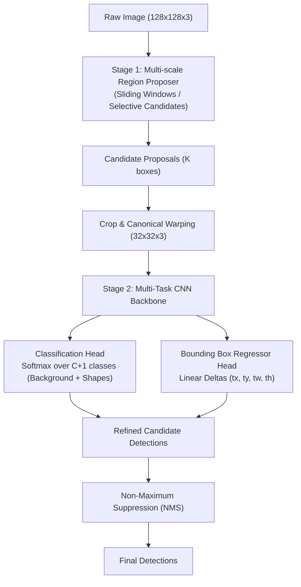

# Experiment 09: Two-Stage Object Detection (Pedagogical R-CNN from Scratch)

[](https://colab.research.google.com/github/jorgvt/CVMIAX/blob/main/experiments/09_simple_rcnn_two_stage_detection/experiment_09_simple_rcnn.ipynb)

A transparent, self-contained educational implementation of a **Two-Stage Object Detector** based on the foundational **R-CNN (Regions with CNN Features)** paradigm.

---

## 🎯 Pedagogical Objectives

1. **Deconstruct the Two-Stage Paradigm**: Dissect how modern deep detection splits the problem into **Stage 1 (Where to look: Region Proposals)** and **Stage 2 (What is there & fine-tuning: Classification + Bounding Box Regression)**.
2. **Understand Bounding Box Delta Parameterization**: Master why detectors predict scale-invariant relative coordinate deltas $(\Delta x, \Delta y, \Delta w, \Delta h)$ rather than raw absolute pixel coordinates.
3. **IoU Matching & Hard Negative Sampling**: Explore how candidate proposals are matched with ground truth objects, and why hard negative sampling is critical for suppressing false positives.
4. **Hands-On Non-Maximum Suppression (NMS)**: Implement greedy NMS from scratch and visualize how redundant overlapping proposals are filtered into crisp single detections.
5. **Fast Caching & Checkpointing**: Save and load pre-trained checkpoints so students and educators can modify visualizations instantaneously without retraining.

---

## 🧠 Theory & Mathematical Formulations



### 1. Intersection over Union (IoU)
The spatial overlap between a candidate proposal $P$ and ground-truth box $G$ is computed as:

$$\text{IoU}(P, G) = \frac{\text{Area}(P \cap G)}{\text{Area}(P \cup G)} = \frac{\text{Area}(P \cap G)}{\text{Area}(P) + \text{Area}(G) - \text{Area}(P \cap G)}$$

- **Positive Proposals ($\text{IoU} \ge 0.5$)**: Assigned the ground-truth shape label and regression target deltas.
- **Negative Proposals ($\text{IoU} < 0.2$)**: Assigned class 0 (Background) with zero regression weight.
- **Ambiguous Proposals ($0.2 \le \text{IoU} < 0.5$)**: Ignored during training to prevent noisy gradients.

---

### 2. Bounding Box Delta Parameterization (Girshick et al., 2014)
Given a proposal $P = (x_p, y_p, w_p, h_p)$ and a target box $G = (x_g, y_g, w_g, h_g)$ in center-size format:

$$\begin{aligned}
t_x &= \frac{x_g - x_p}{w_p}, \quad &t_y &= \frac{y_g - y_p}{h_p} \\
t_w &= \log\left(\frac{w_g}{w_p}\right), \quad &t_h &= \log\left(\frac{h_g}{h_p}\right)
\end{aligned}$$

At inference time, predicted deltas $(\hat{t}_x, \hat{t}_y, \hat{t}_w, \hat{t}_h)$ decode the refined box coordinates:

$$\begin{aligned}
\hat{x} &= x_p + w_p \cdot \hat{t}_x, \quad &\hat{y} &= y_p + h_p \cdot \hat{t}_y \\
\hat{w} &= w_p \cdot \exp(\hat{t}_w), \quad &\hat{h} &= h_p \cdot \exp(\hat{t}_h)
\end{aligned}$$

---

### 3. Multi-Task Loss Formulation
The network optimizes a joint loss over classification and box regression:

$$\mathcal{L} = \mathcal{L}_{\text{cls}}(p, u) + \lambda \cdot [u \ge 1] \cdot \mathcal{L}_{\text{reg}}(t, v)$$

where:
- $\mathcal{L}_{\text{cls}}$ is Sparse Categorical Cross-Entropy across all proposals.
- $[u \ge 1]$ is an indicator ensuring regression loss is **only computed for foreground/positive proposals** (background patches do not have target boxes).
- $\mathcal{L}_{\text{reg}}$ is Huber / Smooth $L_1$ loss.
- $\lambda = 1.0$ balances classification and localization objectives.

---

### 4. Greedy Non-Maximum Suppression (NMS)
1. Sort candidate boxes by class confidence score in descending order.
2. Pick the box $B_{\text{best}}$ with the highest score and add it to the final detection list.
3. Compute $\text{IoU}(B_{\text{best}}, B_i)$ for all remaining boxes.
4. Discard any box $B_i$ where $\text{IoU} > \text{threshold}_{\text{NMS}}$.
5. Repeat until no candidates remain.

---

## 📁 Modular Code Structure

```
experiments/09_simple_rcnn_two_stage_detection/
├── README.md                          # Theory, math, and architectural explanation
├── dataset.py                         # Synthetic multi-shape canvas generator
├── proposals.py                       # Sliding window proposer, IoU matcher, bbox encoder/decoder
├── models.py                          # Keras multi-task CNN (Classification + BBox Regression)
├── train.py                           # Training loop with hard negative sampling & checkpointing
├── evaluate.py                        # Pure Python NMS, end-to-end detection, and mAP@0.5
├── visualize.py                       # Representative pedagogical multi-panel visualizers
├── run_all.py                         # Single CLI execution entrypoint
├── experiment_09_simple_rcnn.py       # Master Jupytext py:percent interactive lesson
├── experiment_09_simple_rcnn.ipynb    # Synchronized Jupyter notebook with Colab badge
└── checkpoints/                       # Cached pre-trained weights for instant visualization
    └── rcnn_detector.weights.h5
```

---

## 🚀 How to Run

### 1. Run the Complete Experiment Pipeline
```bash
uv run python experiments/09_simple_rcnn_two_stage_detection/run_all.py
```
*(If a checkpoint already exists, it loads instantly. To force retraining, add the `--retrain` flag).*

### 2. Launch the Interactive Lesson
Open `experiment_09_simple_rcnn.ipynb` in your Jupyter environment or click the Google Colab badge.

### 3. Sync Jupytext Notebooks
```bash
uv run jupytext --sync experiments/09_simple_rcnn_two_stage_detection/experiment_09_simple_rcnn.py
```

---

## 📊 Evolutionary Context

| Architecture | Proposal Source | Feature Extraction | Bottleneck |
| :--- | :--- | :--- | :--- |
| **R-CNN** (2014) | External Selective Search | 2,000 separate CNN forward passes per image | Very slow (~47s / img) |
| **Fast R-CNN** (2015) | External Selective Search | Single image forward pass + **RoI Pooling** | Fast CNN (~2s / img) |
| **Faster R-CNN** (2015) | **Region Proposal Network (RPN)** | Shared feature map + differentiable anchor proposals | Real-time (~0.2s / img) |
