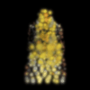

# Experiment 12: 3D Gaussian Splatting (3DGS) for Real-Time Novel View Synthesis

[](https://colab.research.google.com/github/jorgvt/CVMIAX/blob/main/experiments/12_3d_gaussian_splatting/experiment_12_3d_gaussian_splatting.ipynb)

---

## Pedagogical Objectives
1. **Explicit vs. Implicit 3D Representations**: Contrast explicit 3D Gaussian primitives with implicit neural coordinate networks (NeRF). Understand why explicit primitive rasterization achieves real-time frame rates ($\ge 100+$ FPS) compared to dense ray marching.
2. **Valid 3D Covariance Parameterization**: Master the decomposition of the 3D covariance matrix $\boldsymbol{\Sigma} = R S S^T R^T$ into unconstrained log-scales $\mathbf{s} \in \mathbb{R}^3$ and unit quaternions $\mathbf{q} \in \mathbb{H}$ to guarantee positive semi-definiteness during gradient descent.
3. **Differentiable EWA Splatting**: Derive the local affine projective camera Jacobian $J$ and understand how 3D ellipsoidal primitives are projected onto the 2D image plane:
   $$\boldsymbol{\Sigma}_{2D} = J W \boldsymbol{\Sigma}_{3D} W^T J^T + \nu I_{2\times2}$$
4. **Front-to-Back Differentiable Alpha Compositing**: Implement point-based volume rendering via depth sorting and the discrete "Over" operator:
   $$C(\mathbf{p}) = \sum_{i=1}^N \mathbf{c}_i \alpha_i(\mathbf{p}) \prod_{j=1}^{i-1} (1 - \alpha_j(\mathbf{p}))$$
5. **End-to-End Photometric Optimization**: Optimize 3D spatial positions, scales, rotations, opacities, and RGB colors directly from calibrated multi-view camera observations using gradient backpropagation.

---

## 1. Background & Conceptual Foundation

Traditional neural rendering methods (like NeRF) evaluate continuous Multi-Layer Perceptrons along hundreds of sample points per ray. For an image of resolution $H \times W$, NeRF requires evaluating the MLP millions of times per frame:
$$\text{Evaluations}_{\text{NeRF}} = H \times W \times N_{\text{samples}}$$

**3D Gaussian Splatting (Kerbl et al., SIGGRAPH 2023)** shifts the paradigm back to **explicit geometry**:
1. The scene is parameterized as an unstructured cloud of 3D Gaussian ellipsoids.
2. Each Gaussian is projected directly onto the 2D image plane in a single forward pass (**splatting**).
3. Overlapping Gaussians are sorted by camera depth and alpha-composited front-to-back.

```
       3D World Space                            2D Image Plane
   ┌───────────────────────┐                  ┌───────────────────┐
   │                       │   EWA Splatting  │   .-'""'-.        │
   │      ( μ, Σ, c, σ )   │ ───────────────► │  /   u,v  \  (c,α)│
   │    3D Gaussian Cloud  │   (Project J)    │  \  Σ_2D  /       │
   │                       │                  │   '-.__.-'        │
   └───────────────────────┘                  └───────────────────┘
```

---

## 2. Mathematical Formulation

### 2.1 3D Gaussian Scene Representation
A 3D Gaussian centered at $\boldsymbol{\mu} \in \mathbb{R}^3$ with covariance $\boldsymbol{\Sigma} \in \mathbb{R}^{3 \times 3}$ is defined by the unnormalized probability density:
$$G(\mathbf{x}) = \exp\left( -\frac{1}{2} (\mathbf{x} - \boldsymbol{\mu})^T \boldsymbol{\Sigma}^{-1} (\mathbf{x} - \boldsymbol{\mu}) \right)$$

To ensure $\boldsymbol{\Sigma}$ remains symmetric positive semi-definite (PSD) throughout gradient descent without costly constrained optimization:
1. **Scale Vector**: $\mathbf{s} = \exp(\mathbf{s}_{\log}) \in \mathbb{R}_{>0}^3$, represented as a diagonal matrix $S = \text{diag}(\mathbf{s})$.
2. **Rotation Quaternion**: $\hat{\mathbf{q}} = \frac{\mathbf{q}}{\|\mathbf{q}\|_2} = (w, x, y, z) \in \mathbb{H}$. The corresponding orthonormal rotation matrix $R \in \text{SO}(3)$ is:
   $$R(\hat{\mathbf{q}}) = \begin{pmatrix}
   1 - 2(y^2 + z^2) & 2(xy - wz) & 2(xz + wy) \\
   2(xy + wz) & 1 - 2(x^2 + z^2) & 2(yz - wx) \\
   2(xz - wy) & 2(yz + wx) & 1 - 2(x^2 + y^2)
   \end{pmatrix}$$
3. **3D Covariance Construction**:
   $$\boldsymbol{\Sigma} = R S S^T R^T = (R S)(R S)^T$$

---

### 2.2 Camera Projection & Projective Jacobian
Given a camera extrinsic transformation $W = R_{\text{w2c}}$ and translation $\mathbf{t}_{\text{c2w}}$:
$$\mathbf{X}_{\text{cam}} = R_{\text{c2w}}^T (\boldsymbol{\mu} - \mathbf{t}_{\text{c2w}}) = (X_c, Y_c, Z_c)^T$$
Along the optical axis, depth in front of the camera is $z = -Z_c$.

The 2D projected pixel coordinates $(u, v)$ for focal length $f$ and principal point $(c_x, c_y)$ are:
$$u = f \frac{X_c}{z} + c_x, \quad v = -f \frac{Y_c}{z} + c_y$$

The local affine projective camera Jacobian $J = \frac{\partial (u, v)}{\partial (X_c, Y_c, Z_c)} \in \mathbb{R}^{2 \times 3}$ is:
$$J = \begin{pmatrix}
\frac{f}{z} & 0 & \frac{f X_c}{z^2} \\
0 & -\frac{f}{z} & -\frac{f Y_c}{z^2}
\end{pmatrix}$$

---

### 2.3 Elliptical Weighted Average (EWA) Splatting
The projected 2D covariance matrix $\boldsymbol{\Sigma}_{2D} \in \mathbb{R}^{2 \times 2}$ on the image plane is obtained via EWA Splatting (Zwicker et al., 2001):
$$\boldsymbol{\Sigma}_{2D} = J \, W \, \boldsymbol{\Sigma}_{3D} \, W^T \, J^T + \nu I_{2\times2}$$
where $\nu \approx 0.3$ is a low-pass anti-aliasing filter that ensures $\boldsymbol{\Sigma}_{2D}$ is strictly invertible and prevents single-pixel aliasing artifacts.

The inverse 2D covariance is computed analytically:
$$\boldsymbol{\Sigma}_{2D}^{-1} = \frac{1}{ad - bc} \begin{pmatrix} d & -b \\ -c & a \end{pmatrix}, \quad \text{where } \boldsymbol{\Sigma}_{2D} = \begin{pmatrix} a & b \\ c & d \end{pmatrix}$$

---

### 2.4 Front-to-Back Volumetric Alpha Compositing
For any pixel $\mathbf{p} = (u_p, v_p)^T$:
1. Sort Gaussians in ascending order of camera depth $z_1 \le z_2 \le \dots \le z_N$.
2. Compute the 2D radial density response:
   $$G_i(\mathbf{p}) = \exp\left( -\frac{1}{2} (\mathbf{p} - \mathbf{u}_i)^T \boldsymbol{\Sigma}_{2D, i}^{-1} (\mathbf{p} - \mathbf{u}_i) \right)$$
3. Compute the effective pixel opacity:
   $$\alpha_i(\mathbf{p}) = \sigma_i \cdot G_i(\mathbf{p}), \quad \sigma_i = \text{sigmoid}(\text{logit\_opacity}_i)$$
4. Compute cumulative transmittance:
   $$T_i(\mathbf{p}) = \prod_{j=1}^{i-1} \big(1 - \alpha_j(\mathbf{p})\big), \quad T_1(\mathbf{p}) = 1$$
5. Composite accumulated RGB radiance with background color $\mathbf{C}_{\text{bg}}$:
   $$\hat{C}(\mathbf{p}) = \sum_{i=1}^N T_i(\mathbf{p}) \alpha_i(\mathbf{p}) \mathbf{c}_i + \left(1 - \sum_{i=1}^N T_i(\mathbf{p}) \alpha_i(\mathbf{p})\right) \mathbf{C}_{\text{bg}}$$

---

## 3. Pedagogical Progression: 2D Warm-Up to 3D Scene

### Part 1: 2D Gaussian Image Fitting (Intuition Warm-Up)
Before tackling 3D camera matrices and multi-view ray intersections, students fit 200 2D Gaussian primitives $(\boldsymbol{\mu}_i, \mathbf{s}_i, \theta_i, \sigma_i, \mathbf{c}_i)$ directly to a target 2D image:
- **Takeaway**: Shows how 2D Gaussian ellipses deform, rotate, and overlap to match image boundaries and sharp edges (~25 dB PSNR in 100 iterations).


---

### Part 2: 3D Surface Anchoring via Visual Hull
Naive random 3D initialization scatters Gaussians into empty space, creating floating semi-transparent color clouds (*"floaters"*). To solve this:
- **Foreground Ray Back-Projection**: Multi-view foreground silhouette rays are cast to sample 3D points directly on the physical object volume.
- **Scale Regularization & Bounding**: Gaussian scales are bounded ($s \in [0.005, 0.08]$) and regularized with a scale penalty $\lambda_{\text{scale}} \cdot \text{mean}(s)$ to prevent giant floater expansion.

---

## 4. Modular Architecture

```
experiments/12_3d_gaussian_splatting/
├── README.md                               # Pedagogical theory & math documentation
├── __init__.py                             # Package initialization
├── dataset.py                              # Tiny NeRF loader & visual hull point sampler
├── gaussian_2d.py                          # 2D Gaussian image fitting warm-up module
├── models.py                               # 3D Gaussian model & covariance PSD decomposition
├── splatting.py                            # Differentiable EWA projection & alpha compositing
├── train.py                                # Multi-learning-rate Adam photometric optimizer
├── evaluate.py                             # Quantitative metrics (PSNR, SSIM) & trajectory renderer
├── visualize.py                            # 3D cloud plots, diagnostics, strips & animated GIF
├── run_all.py                              # Master runner (Part 1 2D + Part 2 3D)
├── experiment_12_3d_gaussian_splatting.py  # Master Jupytext py:percent lesson script
└── experiment_12_3d_gaussian_splatting.ipynb # Synchronized interactive notebook
```

---

## 5. Empirical Results & Visualizations

### 5.1 2D Gaussian Image Fitting (Part 1)


### 5.2 3D Surface-Anchored Gaussian Scene Cloud (Part 2)


### 5.3 Training Dynamics


### 5.4 Multi-View Qualitative Reconstruction


### 5.5 360-Degree Orbital Novel View Synthesis



---

## 6. Execution Instructions

### Running the Complete Pipeline:
```bash
uv run python experiments/12_3d_gaussian_splatting/run_all.py
```

### Launching the Interactive Lesson Notebook:
```bash
uv run jupyter lab experiments/12_3d_gaussian_splatting/experiment_12_3d_gaussian_splatting.ipynb
```

### Synchronizing Jupytext:
```bash
uv run jupytext --sync experiments/12_3d_gaussian_splatting/experiment_12_3d_gaussian_splatting.py
```

