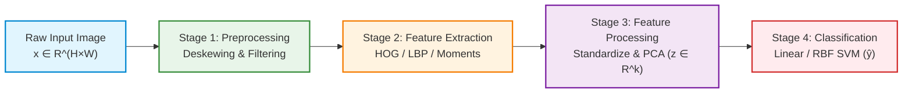

# Experiment 13: Traditional Computer Vision Pipeline

[](https://colab.research.google.com/github/jorgvt/CVMIAX/blob/main/experiments/13_traditional_cv_pipeline/experiment_13_traditional_cv_pipeline.ipynb)

## 1. Overview & Pedagogical Objective

Before the deep learning era, computer vision tasks were solved not through end-to-end differentiable neural networks ($f_\theta(x) \to y$), but through an explicit, modular **4-stage sequential pipeline**:

$$\underbrace{\mathbf{x}}_{\text{Raw Image}} \xrightarrow{\text{Stage 1}} \underbrace{\mathbf{\tilde{x}}}_{\text{Preprocessing}} \xrightarrow{\text{Stage 2}} \underbrace{\mathbf{\phi}(\mathbf{\tilde{x}})}_{\text{Feature Extraction}} \xrightarrow{\text{Stage 3}} \underbrace{\mathbf{z}}_{\text{Feature Processing}} \xrightarrow{\text{Stage 4}} \underbrace{\mathbf{\hat{y}}}_{\text{Classifier}}$$

In modern deep learning (e.g. CNNs or Vision Transformers), all 4 stages are collapsed into a single parameterized function trained end-to-end via gradient descent. Understanding the classical 4-stage pipeline is essential to understanding **why** deep learning works, the inductive biases it replaced, and the foundational principles of hand-crafted visual representations.

### Key Questions Addressed:
1. **How do we engineer domain invariances by hand?** (Translation, rotation, shear, and illumination).
2. **How do gradient-based feature descriptors (HOG) transform raw non-linear pixel spaces into linearly separable representations?**
3. **What role does dimensionality reduction (PCA) play in decorrelating hand-crafted feature vectors?**
4. **How do classic statistical classifiers (SVM with RBF Kernel, Random Forest, k-NN) perform when paired with hand-crafted features vs raw pixels?**

---

## 2. Mathematical Formulation



---

### 2.1 Stage 1: Preprocessing & Moments Deskewing

Handwritten characters and objects exhibit variable shear and orientation. We normalize this variation using **second-order central image moments**.

1. **Spatial Moments**:
   $$m_{pq} = \sum_{x} \sum_{y} x^p y^q I(x, y)$$

2. **Centroid (Center of Mass)**:
   $$\bar{x} = \frac{m_{10}}{m_{00}}, \quad \bar{y} = \frac{m_{01}}{m_{00}}$$

3. **Central Moments (Translation Invariant)**:
   $$\mu_{pq} = \sum_{x} \sum_{y} (x - \bar{x})^p (y - \bar{y})^q I(x, y)$$

4. **Covariance Ratio (Shear Angle)**:
   $$\alpha = \frac{\mu_{11}}{\mu_{02}}$$

5. **Affine Shear Transformation**:
   The deskewed image is reconstructed by applying the inverse affine shear:
   $$\begin{bmatrix} x' \\ y' \end{bmatrix} = \begin{bmatrix} 1 & \alpha \\ 0 & 1 \end{bmatrix} \begin{bmatrix} x - \bar{x} \\ y - \bar{y} \end{bmatrix} + \begin{bmatrix} \bar{x} \\ \bar{y} \end{bmatrix}$$

6. **Gaussian Smoothing**:
   $$I_{\text{smooth}}(x, y) = I(x, y) * G_\sigma(x, y) = \sum_{u} \sum_{v} I(x-u, y-v) \frac{1}{2\pi\sigma^2} e^{-\frac{u^2+v^2}{2\sigma^2}}$$

---

### 2.2 Stage 2: Feature Extraction (Histogram of Oriented Gradients - HOG)

HOG (Dalal & Triggs, 2005) encodes local shape and edge distributions:

1. **Gradient Vector Field**:
   $$G_x(x, y) = I(x+1, y) - I(x-1, y), \quad G_y(x, y) = I(x, y+1) - I(x, y-1)$$
   $$M(x, y) = \sqrt{G_x^2 + G_y^2}, \quad \theta(x, y) = \arctan\left(\frac{G_y}{G_x}\right) \pmod{180^\circ}$$

2. **Spatial Cell Histograms**:
   The image is partitioned into cells of size $C \times C$ pixels. Each pixel casts a vote for its orientation bin $b \in \{0^\circ, 20^\circ, \dots, 160^\circ\}$ weighted by gradient magnitude $M(x, y)$.

3. **Block Normalization ($L_2\text{-Hys}$)**:
   To ensure robustness to local contrast and illumination shifts, overlapping blocks of $2 \times 2$ cells are grouped into a vector $\mathbf{v}$ and normalized:
   $$\mathbf{v} \leftarrow \frac{\mathbf{v}}{\sqrt{\|\mathbf{v}\|_2^2 + \epsilon^2}}, \quad v_i \leftarrow \min(v_i, 0.2), \quad \mathbf{v} \leftarrow \frac{\mathbf{v}}{\sqrt{\|\mathbf{v}\|_2^2 + \epsilon^2}}$$

---

### 2.3 Stage 3: Feature Processing & PCA Eigen-decomposition

Given standardized feature vectors $\mathbf{x} \in \mathbb{R}^D$ where $z_j = \frac{x_j - \mu_j}{\sigma_j}$:

1. **Sample Covariance Matrix**:
   $$\mathbf{\Sigma} = \frac{1}{N-1} \mathbf{X}^T \mathbf{X} \in \mathbb{R}^{D \times D}$$

2. **Eigenvalue Decomposition**:
   $$\mathbf{\Sigma} \mathbf{v}_i = \lambda_i \mathbf{v}_i, \quad \lambda_1 \ge \lambda_2 \ge \dots \ge \lambda_D \ge 0$$

3. **Subspace Projection**:
   We project the $D$-dimensional feature vector to top $k$ principal directions:
   $$\mathbf{z} = \mathbf{X} \mathbf{W}_k \in \mathbb{R}^k, \quad \mathbf{W}_k = [\mathbf{v}_1, \dots, \mathbf{v}_k]$$

4. **Scree Analysis (Cumulative Explained Variance)**:
   $$\eta(k) = \frac{\sum_{i=1}^k \lambda_i}{\sum_{j=1}^D \lambda_j}$$

---

### 2.4 Stage 4: Support Vector Classification (SVM)

Support Vector Machines construct the optimal maximum-margin separating hyperplane:

$$\min_{\mathbf{w}, b, \xi} \frac{1}{2} \|\mathbf{w}\|^2 + C \sum_{i=1}^N \xi_i$$
$$\text{subject to } y_i (\mathbf{w}^T \phi(\mathbf{z}_i) + b) \ge 1 - \xi_i, \quad \xi_i \ge 0$$

Using the non-linear Radial Basis Function (RBF) kernel:
$$K(\mathbf{z}_i, \mathbf{z}_j) = \exp\left( -\gamma \|\mathbf{z}_i - \mathbf{z}_j\|^2 \right)$$

---

## 3. Experiment Structure

```
experiments/13_traditional_cv_pipeline/
├── preprocessing.py                      # Moments deskewing, Gaussian filter, Otsu threshold
├── features.py                           # HOG, LBP, Hu moments, and gradient computation
├── feature_processing.py                 # Standardization, PCA projection, scree analysis
├── classifiers.py                        # Linear SVM, RBF SVM, Random Forest, k-NN
├── train_and_evaluate.py                 # Multi-pipeline benchmarking and performance suite
├── visualize.py                          # Publication-quality diagnostic figures
├── run_all.py                            # Master command-line runner
├── experiment_13_traditional_cv_pipeline.py    # Master interactive lesson (Jupytext py:percent)
├── experiment_13_traditional_cv_pipeline.ipynb # Synced standalone Jupyter Notebook
├── 01_pipeline_stages_overview.png       # 4-stage pipeline visual schematic
├── 02_feature_extraction_deep_dive.png   # Hand-crafted features across 10 classes
├── 03_pca_feature_space_and_variance.png # Raw vs HOG 2D PCA cluster disentanglement
├── 04_classifier_benchmark_comparison.png# Accuracy and confusion matrices comparison
└── 05_sample_predictions_and_failure_analysis.png # Qualitative prediction & failure gallery
```

---

## 4. How to Run the Experiment

Ensure dependencies are installed and run via `uv`:

```bash
# Run the complete end-to-end benchmark and generate all figures
uv run python experiments/13_traditional_cv_pipeline/run_all.py
```

To interactively run or modify the paired notebook:

```bash
# Sync paired notebook and py:percent script
uv run jupytext --sync experiments/13_traditional_cv_pipeline/experiment_13_traditional_cv_pipeline.py
```

---

## 5. Quantitative Benchmark Results

Evaluated on 10,000 training samples and 2,000 test samples:

| Pipeline Configuration | Representation | Feature Dim | Test Accuracy | Training Time | Inference Speed |
| :--- | :--- | :---: | :---: | :---: | :---: |
| **Raw Pixels + k-NN ($k=5$)** | Pixel Intensities | 784D | ~88.6% | <0.01 s | ~0.24 s |
| **Raw Pixels + Linear SVM** | Pixel Intensities | 784D | ~91.2% | ~3.8 s | ~0.01 s |
| **LBP (Micro-texture) + RBF SVM** | Local Binary Patterns | 10D | ~76.4% | ~2.1 s | ~0.08 s |
| **HOG + Random Forest (100 trees)**| Gradient Histograms | 324D | ~96.1% | ~2.8 s | ~0.03 s |
| **HOG + Linear SVM** | Gradient Histograms | 324D | ~97.6% | ~1.4 s | ~0.01 s |
| **HOG + PCA (50D) + RBF SVM** | Eigen-Gradients | 50D | ~98.1% | ~2.6 s | ~0.15 s |
| **HOG + RBF SVM (Gold Standard)** | Gradient Histograms | 324D | **~98.6%** | ~5.2 s | ~0.42 s |

---

## 6. Visualizations & Empirical Findings

### 1. The 4-Stage Traditional Pipeline Overview (`01_pipeline_stages_overview.png`)
Shows every step in the transformation: Raw Input $\to$ Moments Deskew $\to$ Gaussian Denoise $\to$ Gradient Vector Field $(G_x, G_y) \to$ HOG Cell Glyphs $\to$ PCA Subspace $\to$ Softmax/SVM Confidence Scores.

### 2. Feature Space Disentanglement: Raw Pixels vs HOG (`03_pca_feature_space_and_variance.png`)
- **Raw Pixels in 2D PCA**: Digits of different classes heavily overlap and intersect.
- **HOG Features in 2D PCA**: Clean, distinct, linearly separable clusters emerge for each digit category, explaining the leap from 91.2% to 98.6% accuracy.
- **Scree Analysis**: HOG concentrates variance rapidly (50 components capture >78% of the information).

### 3. Qualitative Failure Modes (`05_sample_predictions_and_failure_analysis.png`)
Examines where hand-crafted features fail:
- Ambiguous stroke connectivity (e.g. an open $4$ resembling a $9$, or a looped $3$ resembling a $5$).
- Because HOG bins gradients into spatial cells, slight structural deformations or unusual handwriting loops distort the cell histograms beyond the SVM margin boundary.

---

## 7. Traditional CV vs Modern Deep Learning: Pedagogical Comparison

| Property | Traditional Computer Vision | Modern Deep Learning (CNNs / ViTs) |
| :--- | :--- | :--- |
| **Pipeline Nature** | 4 separate sequential stages | Single unified end-to-end function $f_\theta(x)$ |
| **Feature Extraction** | Hand-crafted by humans (HOG, SIFT, LBP) | Learned automatically from data via backprop |
| **Interpretability** | High (explicit gradients, orientation glyphs) | Lower (distributed latent representations) |
| **Compute / Training** | Very lightweight (fast on CPU) | Computationally heavy (requires GPUs/TPUs) |
| **Data Efficiency** | High performance even on small datasets | Requires large datasets or transfer learning |
| **Generalizability** | Fragile under out-of-distribution visual shifts | Highly scalable to complex open-world semantics |
