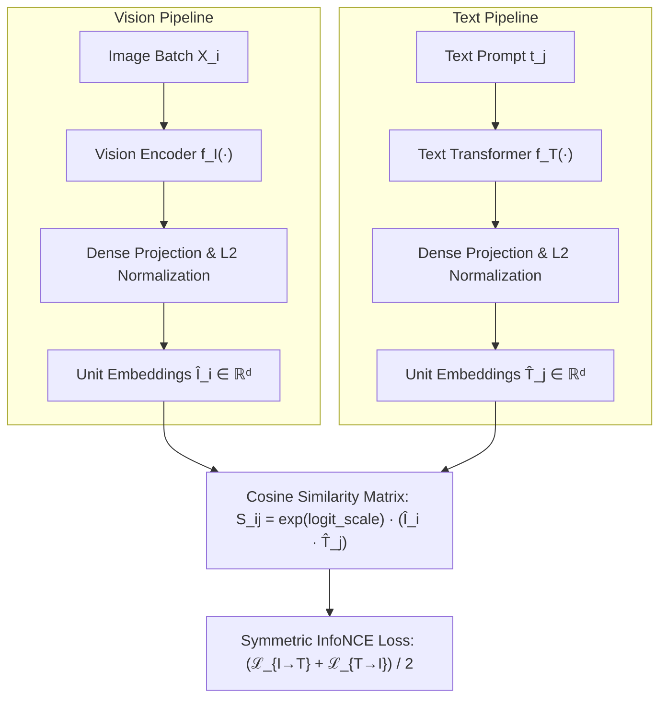

# Experiment 14: Contrastive Language-Image Pre-Training (CLIP)

[](https://colab.research.google.com/github/jorgvt/CVMIAX/blob/main/experiments/14_clip_multimodal_contrastive/experiment_14_clip_multimodal_contrastive.ipynb)

---

## 1. Pedagogical Overview & Theoretical Motivation

Traditional supervised visual classification pipelines train a convolutional neural network with a fixed $K$-way categorical softmax head ($W \in \mathbb{R}^{d \times K}$). This design possesses two severe fundamental limitations:
1. **Closed-Vocabulary Restriction**: The model can only classify images into the exact discrete $K$ labels seen during training. Adding a novel category requires modifying the classifier architecture and retraining.
2. **Semantic Obliviousness**: One-hot labels treat categories as orthogonal discrete indices. The relationship between *"blue square"* and *"yellow square"* is indistinguishable from the relationship between *"blue square"* and *"airplane"*.

**CLIP (Contrastive Language-Image Pre-training)**, introduced by Radford et al. (OpenAI, 2021), revolutionizes visual learning by framing image classification as a **cross-modal metric alignment problem** between images and natural language text.

---

## 2. Mathematical Formulation



### 2.1 Dual Encoders on the Unit Hypersphere
Given an image $x_i$ and text description $t_j$:
$$\hat{I}_i = \frac{f_I(x_i)}{\|f_I(x_i)\|_2}, \quad \hat{T}_j = \frac{f_T(t_j)}{\|f_T(t_j)\|_2}$$

Because both representations reside on the unit hypersphere $\mathcal{S}^{d-1}$, their inner product equals the **cosine similarity**:
$$\cos(\theta_{i, j}) = \hat{I}_i^\top \hat{T}_j \in [-1, 1]$$

### 2.2 Scaled Cosine Similarity Matrix
The similarity matrix for a batch of $N$ paired instances is modulated by a learnable temperature scale $\tau = \exp(\text{logit\_scale})$:
$$S_{i, j} = \tau \cdot \left( \hat{I}_i^\top \hat{T}_j \right)$$

### 2.3 Symmetric InfoNCE Loss
For a batch of $N$ pairs, the diagonal $S_{i, i}$ represents positive pairs, and off-diagonals $S_{i, j}$ ($i \neq j$) represent negatives.

$$\mathcal{L}_{I \to T} = - \frac{1}{N} \sum_{i=1}^N \log \frac{\exp(S_{i, i})}{\sum_{j=1}^N \exp(S_{i, j})}$$

$$\mathcal{L}_{T \to I} = - \frac{1}{N} \sum_{j=1}^N \log \frac{\exp(S_{j, j})}{\sum_{i=1}^N \exp(S_{i, j})}$$

$$\mathcal{L}_{\text{CLIP}} = \frac{1}{2} \left( \mathcal{L}_{I \to T} + \mathcal{L}_{T \to I} \right)$$

---

## 3. Zero-Shot Generalization & Novel Shape Showcase

### 3.1 Compositional Zero-Shot
When pairs like `(yellow, square)` and `(cyan, triangle)` are withheld during training, the network learns independent projections for colors (*yellow, cyan*) and shapes (*square, triangle*). At inference, the model projects unseen composite prompts like *"a photo of a yellow square"* into the region where yellow and square features intersect.

### 3.2 Novel Geometric Figures (Star & Diamond)
When novel shapes like **5-pointed Stars** or **Diamonds** are introduced at test time:
1. **Color Invariance**: The model isolates the color attribute with near-100% confidence.
2. **Geometric Feature Proximity**: Shape uncertainty is cleanly distributed across visually adjacent topological neighbors (e.g., sharp corners sharing convolutional activations with triangles and hexagons).

---

## 4. Key Visualizations

All publication-grade visual artifacts are saved inside `figures/`:
- `clip_architecture_and_infonce.png`: Full architectural flow and InfoNCE mechanism diagram.
- `clip_training_dynamics.png`: Training/validation InfoNCE loss curves, directional top-1 accuracies, and temperature $\tau$ evolution.
- `clip_similarity_matrix_heatmap.png`: Contrastive alignment heatmap before training vs. after pre-training.
- `clip_zero_shot_classification.png`: Zero-shot predictions on seen pairs, compositional hold-outs, and novel star/diamond shapes with probability distributions.
- `clip_cross_modal_retrieval.png`: Text-to-Image top-5 retrieved images.
- `clip_joint_embedding_space.png`: 2D PCA projection of shared multimodal space showing image and text cluster alignment.

---

## 5. How to Run

To run the complete training pipeline and generate all figures:
```bash
uv run python -m experiments.14_clip_multimodal_contrastive.run_all
```

To synchronize the paired Jupytext notebook:
```bash
uv run jupytext --set-formats py:percent,ipynb experiments/14_clip_multimodal_contrastive/experiment_14_clip_multimodal_contrastive.py
uv run jupytext --sync experiments/14_clip_multimodal_contrastive/experiment_14_clip_multimodal_contrastive.py
```
